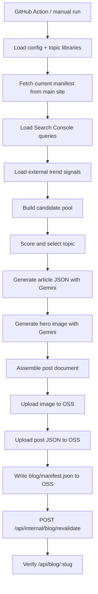

# Blog Automation Architecture

## Overview

`automation/blog-publisher` is a standalone content automation project for CollabGrow.

Its job is not to serve blog pages directly. Its job is to:

1. select a topic
2. generate the article and hero image
3. upload the content to OSS
4. notify the main site that a new manifest is available

The main site remains responsible for:

- rendering `/blog`
- rendering `/blog/:slug`
- SSR SEO output
- sitemap generation
- runtime blog API

In other words:

- `blog-publisher` = content production and publishing
- main project = content delivery and SEO rendering

---

## Version Status

As of this document, the three planned stages are implemented:

### V1

Introduced a structured topic engine instead of a flat random topic list.

Core capabilities:

- four content layers
- product mapping
- structured article generation
- OSS upload
- revalidate callback to main site

### V1.5

Improved content quality and selection quality.

Core capabilities:

- programmatic templates split into multiple types
- tone rules to reduce AI-sounding output
- softer CTA strategy
- internal linking
- topic ledger and publish log
- stronger dedupe and cannibalization control

### V2

Integrated Search Console as a first-class query signal source.

Core capabilities:

- Search Console API via `googleapis`
- query filtering
- creator-business relevance scoring
- query-to-topic transformation
- query signals blended into the main scoring model

### V3

Integrated external trend signals.

Core capabilities:

- Currents API ingestion
- GNews API ingestion
- source normalization
- trend filtering and scoring
- trend signals merged into `trend_linked`
- external trend candidates prioritized over pseudo-trend internal queries when available

---

## Directory Structure

Main entry:

- [publish-generated-blog.mjs](/Users/yu/工作代码/collabGrow-web/automation/blog-publisher/src/publish-generated-blog.mjs)

Configuration and topic data:

- [topic-library.json](/Users/yu/工作代码/collabGrow-web/automation/blog-publisher/data/topic-library.json)
- [programmatic-library.json](/Users/yu/工作代码/collabGrow-web/automation/blog-publisher/data/programmatic-library.json)
- [query-rules.json](/Users/yu/工作代码/collabGrow-web/automation/blog-publisher/data/query-rules.json)
- [scoring-rules.json](/Users/yu/工作代码/collabGrow-web/automation/blog-publisher/data/scoring-rules.json)
- [internal-linking-rules.json](/Users/yu/工作代码/collabGrow-web/automation/blog-publisher/data/internal-linking-rules.json)
- [tone-rules.json](/Users/yu/工作代码/collabGrow-web/automation/blog-publisher/data/tone-rules.json)
- [trend-rules.json](/Users/yu/工作代码/collabGrow-web/automation/blog-publisher/data/trend-rules.json)

Runtime state:

- `.data/publish-log.json`
- `.data/topic-ledger.json`
- `.data/generated-blog-preview/*`

Project metadata:

- [package.json](/Users/yu/工作代码/collabGrow-web/automation/blog-publisher/package.json)
- [README.md](/Users/yu/工作代码/collabGrow-web/automation/blog-publisher/README.md)

---

## Layer Model

The topic engine uses four layers.

### 1. `core_editorial`

Purpose:

- evergreen creator-business content
- strongest topical authority building
- strongest `Deal Hunter` support

Typical topics:

- sponsorship qualification
- workflow design
- deal red flags
- creator decision frameworks

### 2. `tool_problem`

Purpose:

- problem-solving content mapped to `Email Decoder` or `Brand Analyze`

Typical topics:

- how to review a sponsorship email
- how to evaluate a brand
- how to interpret risks before replying

### 3. `controlled_programmatic`

Purpose:

- controlled scale content around brands, email patterns, and creator scenarios

Subtypes:

- `brand_review`
- `brand_fit`
- `email_pattern`
- `creator_scenario`

### 4. `trend_linked`

Purpose:

- bring in timely signals without turning the blog into a generic news site

Signal sources:

- Search Console trend-like queries
- external trend articles from Currents and GNews

---

## End-to-End Flow

The production flow looks like this:



---

## Selection Pipeline

### Step 1. Load base libraries

The system loads:

- topic library
- programmatic library
- query rules
- scoring rules
- tone rules
- trend rules

### Step 2. Read the current manifest

The publisher asks the main site which manifest is active:

- `GET /api/internal/blog/manifest`

If that fails, it falls back to:

- `https://lgi-static.oss-ap-southeast-1.aliyuncs.com/blog/manifest.json`

This keeps publishing aligned with the site’s current runtime content source.

### Step 3. Pull Search Console queries

V2 uses:

- `BLOG_SEARCH_CONSOLE_PROPERTY`
- `BLOG_SEARCH_CONSOLE_CREDENTIAL_JSON`

The implementation uses `googleapis`, not a custom token exchange layer.

Queries are then filtered by:

- brand term blacklist
- ignore term blacklist
- legacy topic blacklist
- minimum token count
- minimum impressions
- creator-business relevance
- combined relevance + opportunity threshold

Accepted queries are rewritten into cleaner article seeds instead of being used raw.

Example:

- raw query: `ai brand checker`
- transformed seed topic:
  `How creators should use AI brand checker to vet brand fit before saying yes`

### Step 4. Pull external trend signals

V3 uses:

- Currents API
- GNews API

The two APIs return different payload shapes, so they are normalized into one internal article format:

- `title`
- `description`
- `url`
- `sourceName`
- `publishedAt`
- `provider`

The system does not require full article body content.

Trend articles are not republished as news.
They are only used as trend signals.

### Step 5. Trend filtering

Trend candidates must pass:

- creator/platform relevance
- creator-business relevance
- blocked term filtering
- freshness score
- minimum total trend score

If a `trend_linked` run has at least one real external trend candidate, the selector prefers those over weaker pseudo-trend candidates.

### Step 6. Candidate scoring

All topic candidates eventually go through the same scoring engine.

Important factors:

- business fit
- search intent
- conversion fit
- topical gap
- freshness
- priority
- cannibalization risk

### Step 7. Draft generation

The article prompt includes:

- target layer
- target product
- audience
- angle
- tone constraints
- phrase blacklist
- template profile
- recent post overlap guard
- optional trend context

### Step 8. Image generation

The hero image is generated separately with:

- `gemini-3.1-flash-image-preview`

Target:

- editorial hero image
- `1200x630`
- no UI
- no watermark
- no text

### Step 9. Assembly and enrichment

After text generation, the script:

- ensures a proper H1
- appends tool CTA section
- appends related reading section
- builds the final post JSON
- computes the next manifest

### Step 10. Publish

Objects uploaded to OSS:

- hero image
- `blog/posts/{slug}.json`
- `blog/manifest.json`

### Step 11. Notify the main site

The publisher notifies the main site:

- `POST /api/internal/blog/revalidate`

Payload:

```json
{
  "manifestUrl": "https://lgi-static.oss-ap-southeast-1.aliyuncs.com/blog/manifest.json"
}
```

### Step 12. Verify

The publisher verifies:

- `GET /api/blog/:slug`

This is a post-publish smoke test, not the rendering pipeline itself.

---

## Main Project Interaction

The automation project and the main project communicate only through:

### 1. OSS

The publisher writes:

- image files
- post JSON files
- manifest JSON

The main project reads from OSS at runtime.

### 2. Main site APIs

Used by the automation:

- `GET /api/internal/blog/manifest`
  - read current active manifest URL
- `POST /api/internal/blog/revalidate`
  - switch active manifest and clear cache
- `GET /api/blog/:slug`
  - smoke test after publish

This separation is intentional:

- automation does not render pages
- main site does not generate content

---

## Main Project Responsibilities

The main project is still responsible for:

- SSR rendering of blog pages
- SEO metadata output
- sitemap generation
- runtime blog APIs
- public page delivery

Important related files in the main project include:

- [server/utils/blog.ts](/Users/yu/工作代码/collabGrow-web/server/utils/blog.ts)
- [server/api/internal/blog/manifest.get.ts](/Users/yu/工作代码/collabGrow-web/server/api/internal/blog/manifest.get.ts)
- [server/api/internal/blog/revalidate.post.ts](/Users/yu/工作代码/collabGrow-web/server/api/internal/blog/revalidate.post.ts)
- [server/api/blog.get.ts](/Users/yu/工作代码/collabGrow-web/server/api/blog.get.ts)
- [server/api/blog/[slug].get.ts](/Users/yu/工作代码/collabGrow-web/server/api/blog/[slug].get.ts)

---

## Technologies Used

### Runtime

- Node.js
- `pnpm`
- ES modules

### Storage

- Alibaba Cloud OSS
- `ali-oss`

### AI generation

- Yunwu AI endpoint
- `gemini-3-flash-preview`
- `gemini-3.1-flash-image-preview`

### Search data

- Google Search Console API
- `googleapis`

### External trend sources

- Currents API
- GNews API

### Delivery integration

- Nuxt/Nitro main site runtime APIs

---

## Environment Variables

### Required for normal publishing

- `BLOG_AI_API_KEY`
- `BLOG_OSS_ACCESS_KEY_ID`
- `BLOG_OSS_ACCESS_KEY_SECRET`
- `BLOG_REVALIDATE_SECRET`

### Core runtime

- `SITE_BASE_URL`
- `BLOG_AI_BASE_URL`
- `BLOG_TEXT_MODEL`
- `BLOG_IMAGE_MODEL`
- `BLOG_OSS_BUCKET`
- `BLOG_OSS_ENDPOINT`
- `BLOG_OSS_PREFIX`
- `BLOG_MANIFEST_URL`
- `BLOG_PROJECT_ROOT`
- `BLOG_TIMEZONE`

### V2 Search Console

- `BLOG_SEARCH_CONSOLE_PROPERTY`
- `BLOG_SEARCH_CONSOLE_CREDENTIAL_JSON`
- `BLOG_SEARCH_CONSOLE_LOOKBACK_DAYS`
- `BLOG_SEARCH_CONSOLE_EXPORT_PATH`

Recommended production property:

- `https://collabgrow.lgi365.com`

### V3 Trend sources

- `BLOG_CURRENTS_API_KEY`
- `BLOG_GNEWS_API_KEY`
- `BLOG_TREND_LOOKBACK_HOURS`
- `BLOG_TREND_LANG`
- `BLOG_TREND_COUNTRY`

Recommended defaults:

- `BLOG_TREND_LOOKBACK_HOURS=72`
- `BLOG_TREND_LANG=en`
- `BLOG_TREND_COUNTRY=us`

---

## Commands

### Syntax check

```bash
pnpm --dir /Users/yu/工作代码/collabGrow-web/automation/blog-publisher check
```

### Dry-run

```bash
pnpm --dir /Users/yu/工作代码/collabGrow-web/automation/blog-publisher blog:publish:dry-run
```

### Dry-run with layer override

```bash
pnpm --dir /Users/yu/工作代码/collabGrow-web/automation/blog-publisher blog:publish:dry-run -- --layer core_editorial
pnpm --dir /Users/yu/工作代码/collabGrow-web/automation/blog-publisher blog:publish:dry-run -- --layer controlled_programmatic
pnpm --dir /Users/yu/工作代码/collabGrow-web/automation/blog-publisher blog:publish:dry-run -- --layer trend_linked
```

### Real publish

```bash
pnpm --dir /Users/yu/工作代码/collabGrow-web/automation/blog-publisher blog:publish
```

---

## Self-Check Summary

This round of self-check verified:

### Verified

- `pnpm check` passes
- V1/V1.5 topic engine is intact
- V2 Search Console integration is working
- URL property `https://collabgrow.lgi365.com` works
- `service_account` authentication works
- V3 dual-source trend pipeline works
- normalized trend source format works
- trend candidates can override weak pseudo-trend internal candidates
- dry-run can complete through article and image generation

### Current practical notes

- GNews free tier works, but has free-plan limits:
  - delayed news
  - query length constraints
  - possible rate limiting if overused
- Currents is integrated, but its returned relevance is currently noisier than GNews for this use case
- Because of that, V3 currently relies more heavily on GNews for useful trend candidates

This is not a blocker, but it is worth knowing operationally.

---

## Recommended Operating Model

### Best current mix

- V1/V1.5 libraries provide the stable editorial backbone
- V2 Search Console provides real demand signals
- V3 trend layer provides freshness and selective topic acceleration

### Recommended priority

- Search Console remains the main signal source
- topic libraries remain the main authority-building source
- trend sources remain a low-volume, high-filter supplemental source

That keeps the system aligned with SEO goals:

- more Deal Hunter clicks
- more non-brand traffic
- stronger topical authority

---

## Suggested Next Steps

If the current architecture stays in use, the next improvements should be:

1. improve Currents query quality or replace it with a stronger trend source
2. add performance feedback back into topic scoring
3. log per-post origin more explicitly for reporting
4. sync the latest V3 code to the standalone GitHub `auto-blog` repository if not already updated

